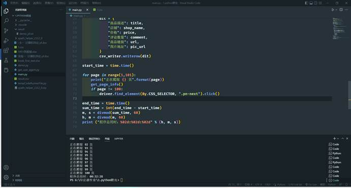
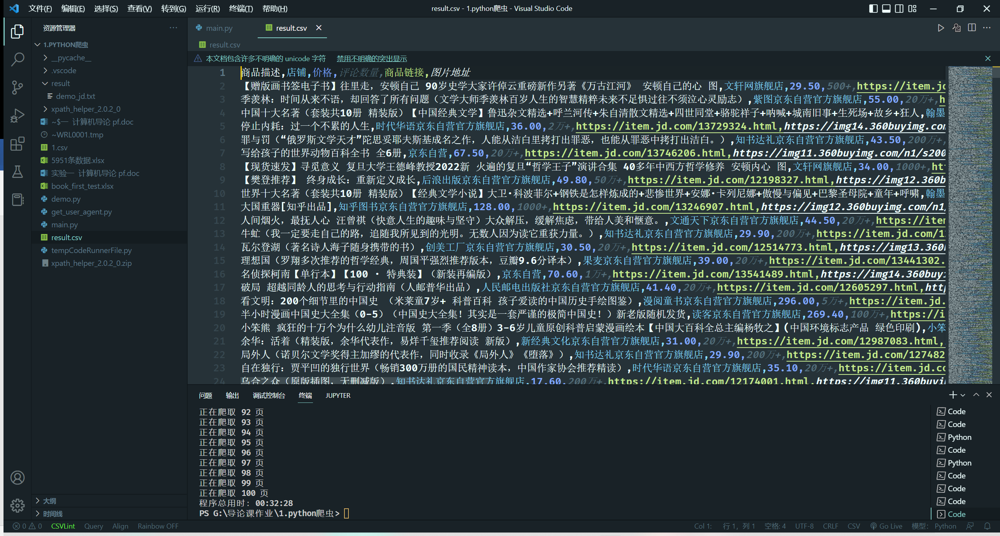
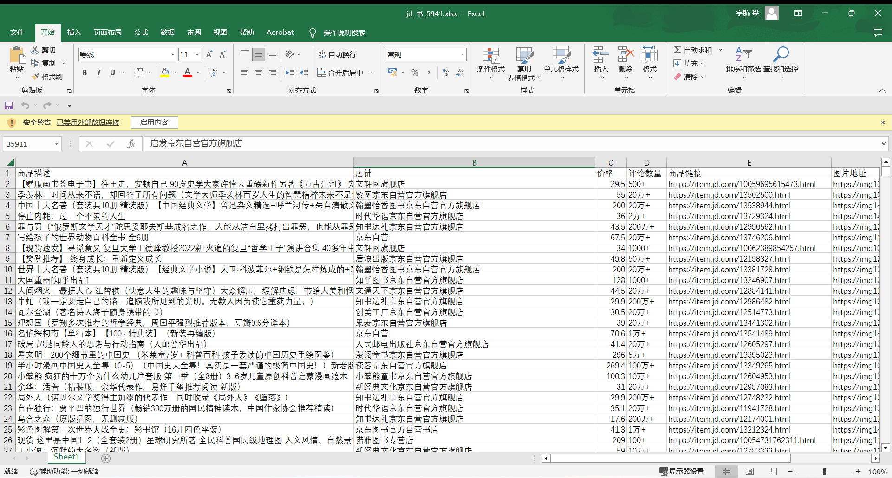
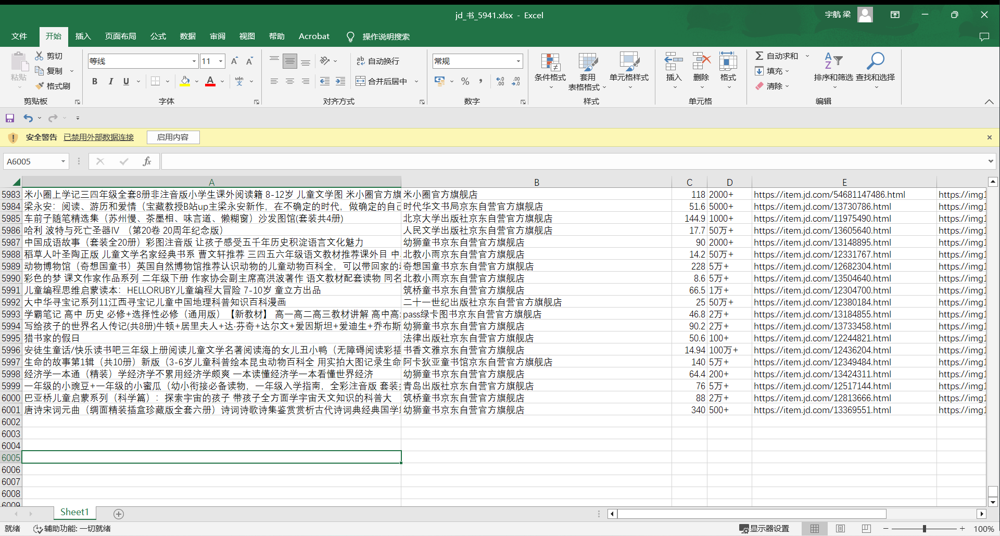

因为我有python的基础，所以直接使用了本地已有的环境（vsc + virtualenv）

**程序运行如下：**

基于 **python + selenium** **爬取京东任意关键词的全部搜索数据

通过**css**进行元素定位与获取，最后将数据存储到**csv**文件中

后将**csv****通过**excel**转换为**xlsx**格式，方便下一步操作或者数据分析

